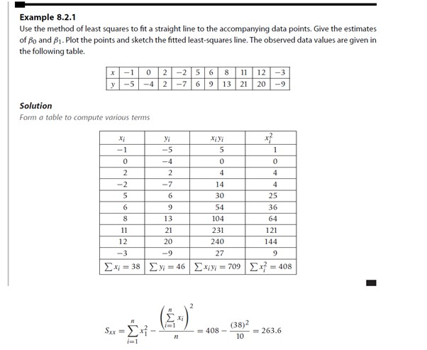
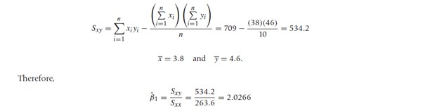
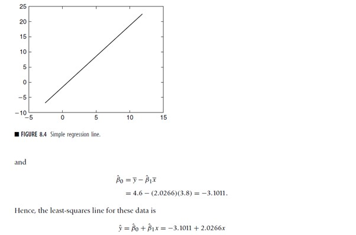
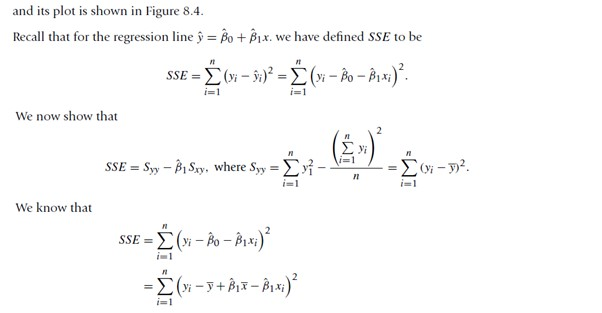
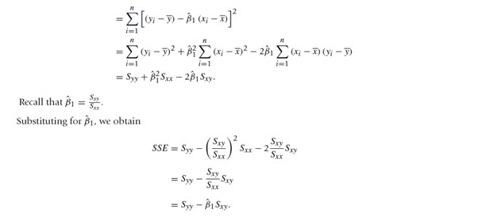

# Regression using C++

## Taking data from a CSV file and then making a regression line

Below is the implementation of the Least Squares method

### The dataset taken in consideration in this repository is my_data.csv

Present in the data folder of this repository

### Final solution of the my_data.csv file is

The final regression line is y=-3.10091 + 2.02656x

