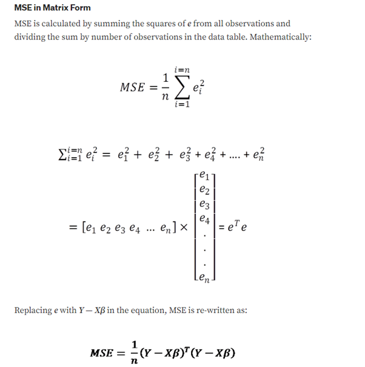

# Regression using C++

## Taking data from a CSV file and then making a regression line

Below is the implementation of the Multiple Linear Regression Model

### The dataset taken in consideration in this repository is 

Present in the data folder of this repository
