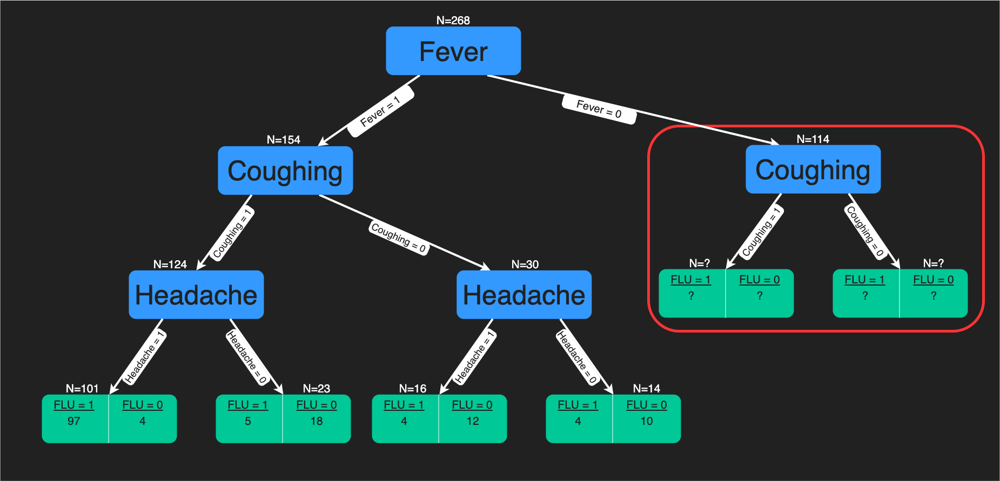
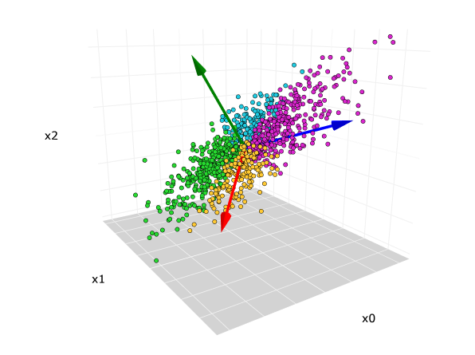

# Learning Machine Learning Algorithms

## Regression

1) Linear Regression

2) Multiple Regression

3) Logistic Regression

4) Ridge Regression

5) Lasso Regression

6) Polynomial Regression

7) Bayesian Linear Regression

## Decision Trees

1) Classification Trees

2) Regression Trees

## Support Vector Machines

1) Simple or linear SVM

2) Kernel or non-linear SVM

## Random Forest

## Cross Validation

1) K-Fold cross-validation

2) Holdout cross validation

3) Leave-p-out cross validation

4) Monte Carlo cross-validation

5) Time series (rolling cross-validation/forward chaining method)

## Naive Bayes Classification

## Hyper Parameter Tuning

##*K-Nearest Neighbours

## Principal Component Analysis

## Ensemble Learning

